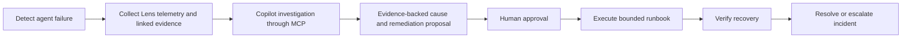

# agenticops-control-tower — Roadmap & Architecture

> **Audit note:** [ROADMAP_AUDIT.md](ROADMAP_AUDIT.md) is an evidence-based
> review of what in this roadmap is actually implemented versus aspirational.
> Read it alongside this document.

## Product Vision: AI-Native Operations Command Center

**OPERATE:** A central control plane for discovering, monitoring, configuring,
and operating agents and DeepAgentLabs capabilities across environments, and
an AI-native operations command center for autonomous agents. It combines live
traces and telemetry, human approval gates, AI-assisted troubleshooting through
MCP and an operations copilot, and automated runbooks to detect, diagnose,
remediate and verify recovery in real time.

This is the intended product, not a description of features already shipped.
Today's registry, inventory, status and native artifact readers are its foundation.
The copilot is a planned Tower capability; no particular third-party Copilot
product is required by this roadmap.

The core operator workflow is:



Tower owns the incident lifecycle and investigation workflow. Lens owns trace
capture and analysis, Evals owns scoring and release gates, Sidecar supervises
agent actions, and Chaos supplies controlled resilience scenarios. MCP exposes
real tools and APIs to the copilot; it does not supply causal reasoning by itself.
AIOS remains the draft shared-semantics authority.

Root-cause findings must cite the traces, tool calls, prompt versions, dependency
errors and timeline that support them. Distinguish confirmed causes from
hypotheses, state confidence and missing evidence, and never present an
unsupported explanation as an exact RCA.

## Release Status

- **v0.1** ✅ Implemented locally (merge/release pending) — registration, heartbeat, metadata, capability discovery,
  HTTP API, optional SQLite persistence, and reader/writer bearer authorization
- **v0.2** ✅ Implemented locally (merge/release pending) — HTTP and snapshot CLI, shared health rollups,
  capability coverage and version inventory, and agent filters
- **v0.3** ✅ Implemented locally (merge/release pending) — AgenticOps Console (read-only dashboard)
- **v0.4** 🚧 Planned — Configuration Model and Controlled Write Operations
- **v0.5** 🏗️ Partial — Lens, Evals, Sidecar, and Chaos artifact readers; remote collection and operator surfaces remain planned
- **v0.6** 🚧 Planned — Agentic MCP Connector and Investigation Copilot
- **v0.6.x** 🚧 Planned — First Approved Incident-to-Recovery Scenario
- **v0.7** 🚧 Planned — Multi-Agent Operations and Bulk Actions
- **v0.8** 🚧 Planned — Live Detection, Alerts, Audit Trails, and Incident Views
- **v0.9** 🚧 Planned — Automated Runbooks and Recovery Workflows
- **v1.0** 🚧 Planned — Stable Control Plane and Published Capability Contract

v0.1 and v0.2 share a tested Python control model, optional SQLite registry,
authenticated HTTP API and operator CLI. The read-only console ships in v0.3. Later milestones remain planned or partial:
configuration, ecosystem adapters, MCP connector, bulk operations, and incident
workflows. See [ROADMAP_AUDIT.md](ROADMAP_AUDIT.md) for implementation evidence.

## Design Constraints

These should shape the build order from the start, not be rediscovered later.

1. **Inventory before orchestration.** The first release should answer
   "what exists and what is installed?" before attempting "change it
   remotely." A control plane without trusted inventory is theater.
2. **Read-only before write-capable.** Cross-agent configuration and
   operations are the highest-risk part of the vision. Prove registration,
   discovery, and status first.
3. **API and CLI before dashboard.** The web console should sit on top of the
   same control model, not become the place where the actual behavior lives.
4. **Capability adapters should stay thin.** Control Tower should reuse
   sibling project contracts and metadata rather than re-implement Lens,
   Evals, Sidecar, or Chaos logic locally.
5. **Runtime-agnostic means avoiding runtime assumptions in v0.1.** Do not
   build the first version around Kubernetes-specific or cloud-specific
   registration mechanics.
6. **MCP is downstream of the control API.** Agentic MCP integration is
   valuable, but only after there is a real control-plane surface to expose.
7. **Automatic discovery where possible, explicit registration where
   necessary.** The architecture should prefer discovery, but not block the
   product on perfect autodetection across every environment.

8. **Evidence before causal claims.** Copilot findings cite source artifacts;
   absent evidence stays absent, and hypotheses remain explicit.
9. **Approval before remediation.** The first incident loop requires a human
   approval bound to the exact target and action parameters. MCP or copilot
   access never bypasses authorization.
10. **Execution is not recovery.** Successful commands do not resolve incidents;
    recovery requires recorded checks against telemetry and explicit criteria.

## Cross-Project Dependencies

`agenticops-control-tower` is the ecosystem control plane, so its roadmap is
mostly about coordinating with sibling projects without absorbing them.

- `agentic-evals`
  Coordinate with: evaluation reports, metric/tag summaries, and release-gate
  decisions; scoring and gate computation remain owned by Evals.
- `agenticlens`
  Coordinate with: how Control Tower reads summarized observability and readiness signals without replacing Lens
  analysis or duplicating Evals scoring.
- `agentic-sidecar`
  Coordinate with: how governance posture, decision summaries, and risk
  signals are surfaced centrally once Sidecar exposes stable runtime output.
- `agentic-chaos`
  Coordinate with: how experiment inventory, last-run status, and resilience
  posture are summarized in the control plane once Chaos artifacts stabilize.
- `mcp-server` (`deep-agentic-core-mcp`)
  Validate in: a future MCP-facing path for AI-native operation against
  Control Tower rather than only against individual sibling packages.
- `ai-operations-spec`
  Coordinate with: agent identity, capability metadata, status events,
  configuration contracts, and operational artifacts that should not drift
  away from the shared ecosystem model.

For roadmap planning, use these meanings consistently:

- `Depends on`: the item cannot ship first.
- `Coordinate with`: sibling repos should be updated in the same window.
- `Validate in`: end-to-end checks should happen in another repo or adapter.

## Definition of Done

A roadmap item is done only when all applicable work is complete:

- implementation is merged and usable through the intended API, CLI, or UI
- tests or fixtures cover the behavior
- operator-facing docs and examples are updated
- `README.md` and this roadmap are updated when the feature changes user
  expectations or milestone status
- capability contracts and ecosystem-facing artifact shapes are documented
- sibling-project checks are recorded where relevant
- release metadata is updated when the work is part of a release-ready change
  set

---

## Architecture

Control Tower should become the **operate/manage layer** across the
DeepAgentLabs stack:

```text
Control Tower = OPERATE
Agentic MCP   = CONNECT
AgenticLens   = OBSERVE
Agentic Evals = EVALUATE
Agentic Sidecar = SUPERVISE
Agentic Chaos = TEST
AI Operations Specification = STANDARDIZE
```

From a developer or operator perspective, the project exists to answer:

`What agents do I have, where are they running, what DeepAgentLabs
capabilities are installed, what is unhealthy, and how do I manage all of that
through one control plane?`

That keeps the package focused on:

- agent registry and lifecycle visibility
- capability inventory and discovery
- control-plane API design
- centralized configuration and safe operations
- operator UX across CLI, console, and AI-facing control

It should not become a hidden duplicate of the sibling runtimes.

## Proposed Product Surfaces

```text
agenticops-control-tower
├── registry/        # agent inventory, heartbeat, runtime metadata
├── discovery/       # capability detection and version inventory
├── api/             # unified control-plane API
├── config/          # central configuration model and safe write paths
├── cli/             # operator CLI
├── console/         # AgenticOps Console / dashboard
└── adapters/        # thin ecosystem adapters (Lens, Evals, Sidecar, Chaos, MCP)
```

This is a proposed shape, not a committed implementation layout.

## Capability Direction

Over time, the control plane should grow around a few clear domains:

- inventory and registration
- health and readiness
- capability discovery
- version and compatibility visibility
- centralized configuration
- operational actions
- auditability and incident posture
- AI-native control through MCP

Contributors should be able to ask:

`Is this feature helping operators understand or safely control deployed
agents, or is it really work that belongs in Lens, Evals, Sidecar, Chaos, MCP, or the
spec repo instead?`

---

## Build Order

## Phase 0: Concept and Product Boundary

Status: complete

Goals:

- define what Control Tower is and is not
- keep boundaries clear against Lens, Evals, Sidecar, Chaos, MCP, and AIOS
- narrow the first implementation into a believable control-plane core

Deliverables:

- [x] architecture concept document
- [x] `README.md`
- [x] `ROADMAP.md`
- [x] implementation scaffold

## Phase 1: Registry and Discovery Core (`v0.1`)

Status: **implemented locally** (merge/release pending) — see [ROADMAP_AUDIT.md](ROADMAP_AUDIT.md#v01-registry-and-discovery-core).

Goals:

- create a minimal agent registry — done, memory or durable SQLite
- accept explicit agent registration and heartbeats — done
- record runtime, framework, environment, and package metadata — done
- expose a read-only API for listing agents and capabilities — done, plus
  the write endpoints below, all HTTP-reachable via the optional `api` extra

Suggested initial surface (all implemented in `api/http.py`):

- [x] `POST /agents/register`
- [x] `POST /agents/{id}/heartbeat`
- [x] `GET /agents`
- [x] `GET /agents/{id}`
- [x] `GET /capabilities` (aggregated across all registered agents)

Success criteria:

- [x] operators can see which agents are known to the system
- [x] each agent record includes capability versions and last-seen status
- [x] the system works without assuming Kubernetes, Docker, or one framework
- [x] example registration payloads exist for at least two runtime styles
      (`examples/sample_agent_registration.json`,
      `examples/sample_agent_registration_kubernetes.json`)

SQLite persistence is enabled with `serve --database registry.sqlite`. Reader and
writer bearer tokens are configured with `AGENTICOPS_READ_TOKEN` and
`AGENTICOPS_WRITE_TOKEN`. Anonymous in-memory mode remains available for local use.

Delivered in `v0.1`:

- thread-safe registry with explicit registration payloads and optional SQLite storage
- reader/writer authorization on every inventory and mutation HTTP route
- heartbeat updates with last-seen tracking and metadata merging
- aggregated capability inventory across known agents
- runtime-agnostic examples for Lambda-style and container-style agents
- tests covering registration, heartbeat, and discovery flows

## Phase 2: CLI and Status Model (`v0.2`)

Status: **implemented locally** (merge/release pending) — see [ROADMAP_AUDIT.md](ROADMAP_AUDIT.md#v02-cli-and-status-model).

Goals:

- ship a first operator CLI — done (`agenticops-control-tower`, optional
  `api` extra)
- add health rollups and version inventory summaries — done
- expose useful filters such as unhealthy agents or agents missing a
  capability — done

Suggested commands (shipped as `agenticops-control-tower <command>`, not
`deepagent <command>` -- no `deepagent` binary exists in this ecosystem):

- [x] `agents list`
- [x] `agents get <agent-id>`
- [x] `capabilities list`
- [x] `status` (health rollup and capability coverage)

Success criteria:

- [x] CLI and API share the same underlying control model (the CLI is an
      HTTP client of `api/http.py`, which wraps the same `ControlTowerAPI`
      facade used directly by tests)
- [x] a user can answer basic inventory questions without touching raw JSON
- [x] health rollups use the same reported status buckets across Python, HTTP and CLI

Delivered in `v0.2`:

- `agenticops-control-tower` console script for operator workflows
- status rollups shared between CLI and Python API
- agent filters for health status, environment, present capability, and missing capability
- capability coverage summaries and fleet status views
- snapshot-based CLI input for offline read-only inspection

## Phase 3: Read-Only Console (`v0.3`)

Status: **implemented locally** (merge/release pending). `/console/` is served
by the optional HTTP app with packaged HTML/CSS/JS. It consumes authenticated
read APIs for health, filtered inventory, capability coverage, explicit minimum
version assessments and agent details. The evidence-readiness view states that
collection/persistence and incident workflows are unavailable; no remediation
controls are exposed. See `tests/test_console.py`.

Goals:

- ship the first AgenticOps Console
- visualize inventory, health, versions, and capability presence
- prepare a read-only incident/evidence view without implying remediation is available
- keep the dashboard read-only at first

Success criteria:

- the console is a thin view over the real API
- one operator can identify unhealthy or outdated agents quickly
- the dashboard does not introduce write-side behavior the API cannot do

## Phase 4: Configuration and Safe Write Operations (`v0.4`)

Goals:

- define a central configuration model for supported capabilities
- add controlled write paths for safe updates
- document which configuration is authoritative versus merely mirrored
- define reusable authorization, action preview, approval and audit contracts
  for later remediation; include target, parameters, impact and expiry
- reject execution when approval is denied, expired, or no longer matches the
  proposed action; capture partial failure and rollback/reconciliation results

Potential operations:

- `config.get(agent_id)`
- `config.update(agent_id, patch)`
- `capabilities.enable(agent_id, capability)`
- `capabilities.disable(agent_id, capability)`

Open risk:

- configuration semantics will differ across Lens, Sidecar, and Chaos, so
  v0.4 must avoid pretending one generic toggle model covers everything.

Success criteria:

- write operations are auditable
- partial failure behavior is explicit
- unsupported configuration surfaces degrade honestly

## Phase 5: Ecosystem Surface Integration (`v0.5`)

Status: **partial**. Native JSON readers and a Tower-local evidence-link contract
are implemented for Lens, Evals, Sidecar and Chaos, with optional tests against
actual sibling models. Remote collection, persistent evidence, HTTP/CLI posture
views, and console integration remain planned. See
[ecosystem-alignment.md](docs/ecosystem-alignment.md).


Goals:

- surface Lens, Evals, Sidecar, and Chaos summaries in the control plane
- add live Lens trace/telemetry collection with explicit deployment, run and
  runtime-participant attribution, observation times and freshness
- correlate tool calls, prompt versions and dependency failures with linked
  evidence; preserve source references and missing/unavailable data
- keep adapters thin and contract-driven
- avoid copying sibling project logic into Control Tower

Examples:

- Lens: trace outcomes, operational evidence, recent findings
- Evals: evaluation summaries and existing release-gate outcomes
- Sidecar: decision summaries, risk posture, intervention counts
- Chaos: experiment inventory, last run, resilience posture

Success criteria:

- operators can inspect high-level posture centrally
- the source of truth for the underlying capability remains in the sibling
  package
- integration failures degrade to "unavailable" rather than crashing the
  control plane

## Phase 6: Agentic MCP Connector and Investigation Copilot (`v0.6`)

Goals:

- expose Control Tower to AI operators through Agentic MCP
- add an operations copilot over authorized evidence-query tools
- investigate incidents by correlating traces, tools, prompts, dependencies,
  deployment changes and sibling outcomes into a causal timeline
- produce a cited diagnosis and a proposed runbook with prerequisites, target,
  parameters, expected impact, rollback and recovery checks
- support AI-native inventory and status queries first
- add write-capable operations only after authorization and audit shape are
  clear

Examples:

- list registered agents
- list unhealthy agents
- show agents with outdated package versions
- inspect recent high-risk Sidecar posture

Success criteria:

- MCP connects to a real control API rather than a demo surface
- read and write operations have distinct authorization boundaries
- examples exist showing MCP with and without Control Tower

## Phase 6A: First Approved Incident-to-Recovery Scenario (`v0.6.x`)

Status: **planned**. This is the first complete command-center demonstration,
not a requirement to finish every fleet-wide alerting feature first.

Depends on: v0.4 approval/authorization contracts, v0.5 live evidence collection,
and v0.6 MCP investigation tools. Bulk operations in v0.7 are not a prerequisite.

Scenario: a staging agent's tool dependency becomes unavailable. Use a controlled
Chaos scenario or deterministic fault fixture; Lens records the failed run and
dependency error. Tower detects the failure and opens a correlated incident.
The copilot explains the causal timeline using the recorded evidence and proposes
one supported remediation runbook. A human reviews and approves its exact target
and parameters. Tower executes the approved action through a bounded connector,
then runs a probe and verifies recovery using fresh Lens evidence and applicable
Evals checks. Failure to verify recovery keeps the incident open and escalates it.

Success criteria:

- [ ] one supported staging runtime completes detect → investigate → recommend
      → approve → execute → verify, through real API/tool paths
- [ ] the incident retains linked trace, tool, prompt and dependency evidence;
      unavailable evidence and uncertain causes remain explicit
- [ ] the diagnosis cites source evidence and distinguishes a confirmed cause
      from a hypothesis; contradictory evidence prevents an unsupported RCA
- [ ] the remediation preview specifies scope, parameters, impact, rollback and
      recovery criteria; approval is attributable and bound to that preview
- [ ] denied, expired or modified approvals cause no remediation execution
- [ ] actions have timeout and retry limits; duplicate requests cannot repeat
      an unsafe action; partial execution is recorded and reconciled
- [ ] fresh telemetry, a successful probe and applicable Evals results determine
      recovery; a successful command alone cannot resolve the incident
- [ ] the incident timeline records detection, investigation, approval,
      execution and verification, including failed-remediation paths
- [ ] an end-to-end fixture and operator walkthrough demonstrate both verified
      recovery and escalation when recovery fails

## Phase 7: Multi-Agent Operations (`v0.7`)

Goals:

- add bulk operations and fleet-wide targeting
- support environment-scoped and capability-scoped actions
- make operational intent explicit before write actions fan out

Examples:

- enable enhanced tracing for all staging agents
- find all agents missing a minimum Sidecar version
- pause a class of experiments across an environment

Success criteria:

- bulk actions include preview and audit paths
- rollback or reconciliation behavior is documented
- targeting semantics are deterministic

## Phase 8: Live Detection, Alerts, Audit, and Incident Views (`v0.8`)

Goals:

- add operator-facing alerts and warnings
- expand the initial detection path into live telemetry-based rules with
  freshness, deduplication and correlation across agents and environments
- expose incident timelines, evidence, copilot findings, approval requests and
  recovery checks in the console; keep stale evidence visibly distinct
- add audit trails for configuration and operations
- add incident-oriented views over agent and capability posture

Success criteria:

- the system explains what changed, when, and by whom or by what control path
- incident views join inventory, health, and recent changes coherently

## Phase 9: Automated Runbooks and Recovery Workflows (`v0.9`)

Status: **planned**. Builds on the approved v0.6.x scenario and the v0.8 incident
surface, extending one supported action into reusable operational workflows.

Goals:

- provide versioned runbooks with prerequisites, scoped targets, ordered actions,
  human approval gates, bounded retries/timeouts and rollback/reconciliation
- let the copilot recommend supported runbooks without inventing executable
  commands or extending an operator's authority
- automate execution and verification after approval; support cancellation,
  interruption recovery and escalation when actions or checks fail
- validate runbooks against controlled Chaos scenarios and record applicable
  Evals results, while leaving those engines in their owning packages

Success criteria:

- each execution records runbook version, evidence, approver, target, actions,
  outputs and verification results in a durable incident timeline
- permission and approval checks apply equally to console, CLI, API and MCP
- tests cover denied approval, changed scope, unavailable dependencies, timeouts,
  repeated requests, partial failure, failed recovery and successful recovery
- no remediation is considered complete until declared recovery criteria pass

## Phase 10: Stable Capability Contract (`v1.0`)

Goals:

- publish a stable capability discovery contract
- lock the core control-plane API semantics
- document supported runtime and framework integration patterns

Success criteria:

- at least two materially different runtimes are validated end to end
- capability metadata and status semantics are versioned
- Control Tower can be described as a stable control-plane product rather than
  a concept repo

---

## Open Questions

- What is the minimum viable registration contract for agents that is still
  useful across runtimes?
- Which fields should be standardized in AIOS versus left as Control Tower
  implementation detail?
- How much of capability discovery can be automatic versus agent-reported?
- When configuration updates fail midway across a fleet, what is the expected
  reconciliation model?
- Should the first implementation be a local-first Python service only, or
  should remote deployment concerns appear in v0.1?

## North Star

An AI-native operations command center where humans and AI operators can detect
agent failures, investigate live evidence, explain supported causes, approve
remediation, execute bounded runbooks and verify recovery across environments.
Fleet inventory and configuration are the foundation of this unified operations
workflow; the incident-to-recovery loop is a first-class product outcome.
